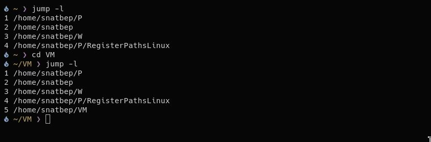
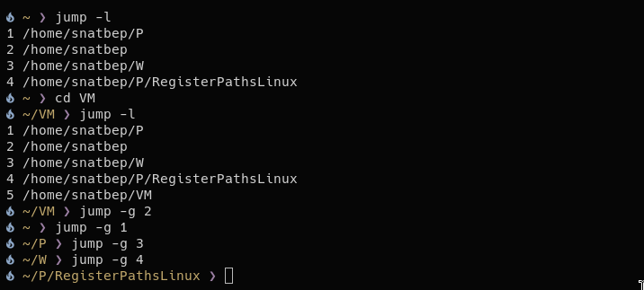

# Jump

_Go to my blog for more technical explanation:_ **[Jump](https://use-root.github.io/zeroot.github.io/)**

---

Jump is a tool that allow you control your history of directories:

- jump -l _List the directories from chpwd-recent-dirs_
- jump -c _Clear all the file_
- jump -g {1-9} _Go to the directory that are register_
- jump -r {1-9} _Remove a directory from the file, with a number_
- jump -e _Edit the directory_ in process

Eventually I want to do it more effitien and with more useful feauteres

The reason behind it is to create my own tool and add my own features and understanding beyond the surface how it works tools like `cdr`.

### Instalation

##### Screenshots

|                                                                               |                                                                             |
| ----------------------------------------------------------------------------- | --------------------------------------------------------------------------- |
|       |    |
|       |   |
|  |  |

### How works
