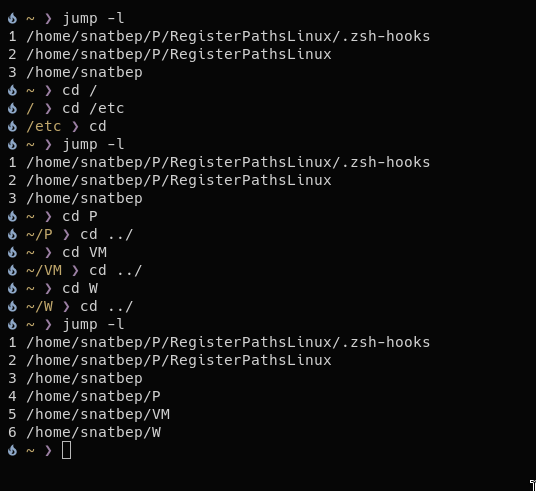
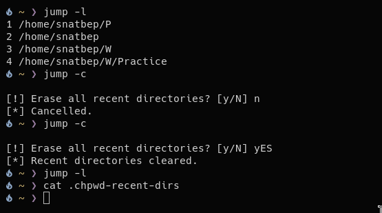
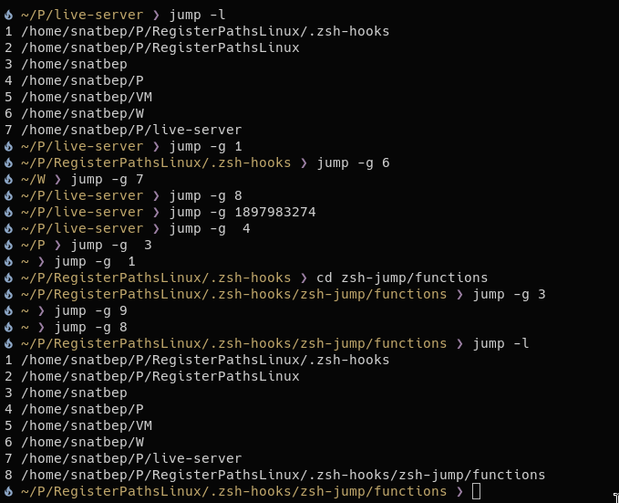
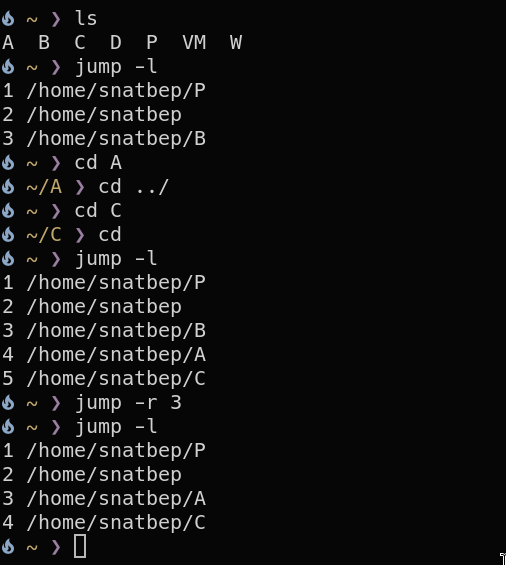
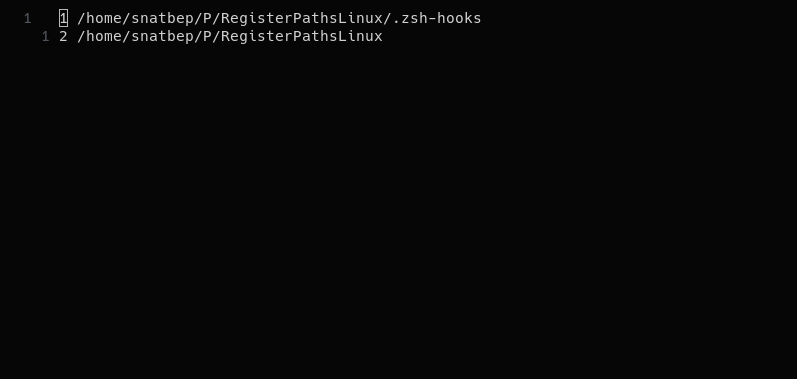

# Jump

**[My Blog technical explanation](https://use-root.github.io/zeroot.github.io/)**

---

Jump is a tool that lets you manage your directory history, and I plan to add more features later.
The motivation is to build my own tool, add custom features, and gain a deeper understanding of how utilities like cdr work under the hood.

- jump -l _List the directories from chpwd-recent-dirs_
- jump -c _Clear all the file_
- jump -g {1-9} _Go to the directory that are register_
- jump -r {1-9} _Remove a directory from the file, with a number_
- jump -e _Edit the directory_ in process

### Instalation

Clone the repository,
Give execute permition of the ./install chmod +x
and the Execute the file

##### Screenshots

|                                                                               |                                                                             |
| ----------------------------------------------------------------------------- | --------------------------------------------------------------------------- |
|  |    |
|  |   |
|  |  |
